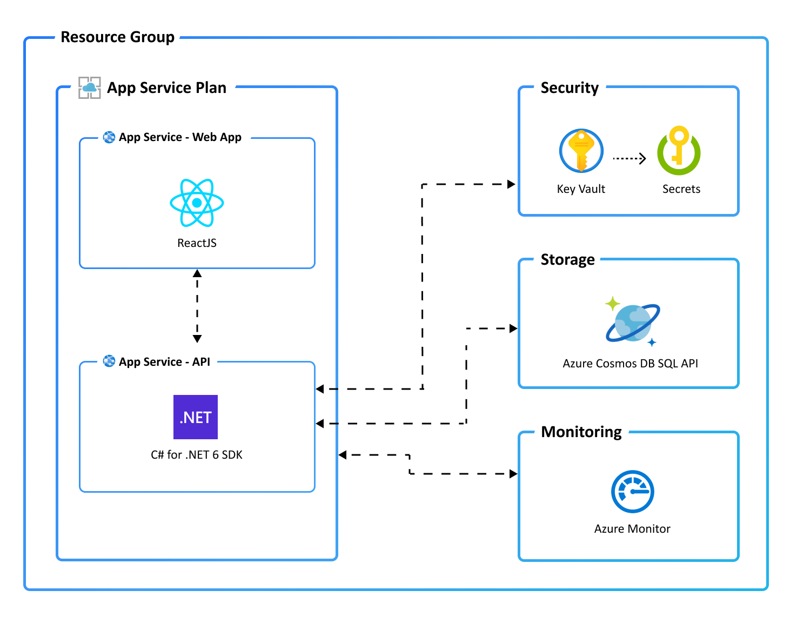

# React Web App with C# API and Cosmos DB for NoSQL on Azure

[](https://codespaces.new/azure-samples/todo-csharp-cosmos-sql)
[](https://vscode.dev/redirect?url=vscode://ms-vscode-remote.remote-containers/cloneInVolume?url=https://github.com/azure-samples/todo-csharp-cosmos-sql)

A blueprint for getting a React web app with a C# API and a MongoDB database running on Azure. The blueprint includes sample application code (a ToDo web app) which can be removed and replaced with your own application code. Add your own source code and leverage the Infrastructure as Code assets (written in Bicep) to get up and running quickly.

Let's jump in and get this up and running in Azure. When you are finished, you will have a fully functional web app deployed to the cloud. In later steps, you'll see how to setup a pipeline and monitor the application.


<sup>Screenshot of the deployed ToDo app</sup>

### Prerequisites
> This template will create infrastructure and deploy code to Azure. If you don't have an Azure Subscription, you can sign up for a [free account here](https://azure.microsoft.com/free/). Make sure you have contributor role to the Azure subscription.


The following prerequisites are required to use this application. Please ensure that you have them all installed locally.

- [Azure Developer CLI](https://aka.ms/azd-install)
- [.NET SDK 8.0](https://dotnet.microsoft.com/download/dotnet/8.0) - for the API backend
- [Node.js with npm (18.17.1+)](https://nodejs.org/) - for the Web frontend
- [Azure Cosmos DB emulator](https://learn.microsoft.com/en-us/azure/cosmos-db/how-to-develop-emulator?tabs=windows%2Ccsharp&pivots=api-mongodb)

### Running locally

#### Quick Start

1. **Run the setup script:**
   ```powershell
   .\start-local.ps1
   ```

2. **Create the database:**
   - Open the Cosmos DB Emulator UI: https://localhost:8081/_explorer/index.html
   - Create a new database named `restoplan` (use all default settings)

3. **Start the services:**
   
   **Option A: One-Click F5 Experience (Recommended)**
   - Press `F5` or go to Run and Debug panel (`Ctrl+Shift+D`)
   - Select "🚀 Start Full Stack (F5 Ready)" from the dropdown
   - Click the play button or press `F5`
   - This will automatically:
     - Start both API and Web servers
     - Wait for them to be ready
     - Open the browser with debugging enabled
     - Connect to both frontend and backend

   **Option B: Using VS Code Tasks (Manual Control)**
   - Press `Ctrl+Shift+P`
   - Type "Tasks: Run Task"
   - Select "Start API" (this will start the API on port 3100)
   - Press `Ctrl+Shift+P` again
   - Type "Tasks: Run Task"
   - Select "Start Web" (this will start the web frontend on port 5173)

   **Option C: Using Debug Configurations (Advanced)**
   - **Step 1**: Start the servers using VS Code Tasks (Option B above)
   - **Step 2**: Use individual debug configurations:
     - Press `F5` or go to Run and Debug panel (`Ctrl+Shift+D`)
     - Select from dropdown:
       - "Debug Web (Browser Only)" - Opens browser with debugging
       - "Debug API (Process Only)" - Debugs the .NET API
       - "Debug API + Web (Full Stack)" - Debugs both together
     - Click the play button

   **Option D: Manual Terminal Commands**
   ```powershell
   # Terminal 1 - API
   cd src/api
   dotnet run

   # Terminal 2 - Web (new terminal)
   cd src/web
   npm run dev
   ```

#### URLs

- **Web Application:** http://localhost:5173
- **API:** http://localhost:3100
- **API Swagger:** http://localhost:3100/swagger
- **Cosmos DB Emulator UI:** https://localhost:8081/_explorer/index.html

#### Detailed Setup (Manual)

If you prefer to set up manually instead of using the setup script:

1. Ensure the prerequisites as mentioned above are installed
1. Install the Azure CLI extension for Visual Studio Code
1. Clone this repository
1. Start the Cosmos DB emulator: `. "C:\Program Files\Azure Cosmos DB Emulator\Microsoft.Azure.Cosmos.Emulator.exe" /EnableMongoDbEndpoint=4.0 /MongoPort=65200`
1. Wait until the browser pops up with the emulator UI (https://localhost:8081/_explorer/index.html)
1. Ensure your `appsettings.Development.json` file looks like this (note the key is no longer present):
    ```json
    {
      "Logging": {
        "LogLevel": {
          "Default": "Information",
          "Microsoft.AspNetCore": "Warning"
        }
      },
      "AZURE_COSMOS_ENDPOINT": "https://localhost:8081",
      "AZURE_COSMOS_DATABASE_NAME": "restoplan"
    }
    ```
1. Set the Cosmos DB key using dotnet user-secrets (recommended):
    ```bash
    cd src/api
    dotnet user-secrets set "AZURE_COSMOS_KEY" "C2y6yDjf5/R+ob0N8A7Cgv30VRDJIWEHLM+4QDU5DE2nQ9nDuVTqobD4b8mGGyPMbIZnqyMsEcaGQy67XIw/Jw=="
    ```
    
    Alternatively, you can set it as an environment variable:
    - On Windows (PowerShell):
      ```powershell
      $env:AZURE_COSMOS_KEY = "C2y6yDjf5/R+ob0N8A7Cgv30VRDJIWEHLM+4QDU5DE2nQ9nDuVTqobD4b8mGGyPMbIZnqyMsEcaGQy67XIw/Jw=="
      ```
    - On Linux/macOS:
      ```bash
      export AZURE_COSMOS_KEY="C2y6yDjf5/R+ob0N8A7Cgv30VRDJIWEHLM+4QDU5DE2nQ9nDuVTqobD4b8mGGyPMbIZnqyMsEcaGQy67XIw/Jw=="
      ```
1. Create a new database using the emulator UI with the name `restoplan` (all defaults)
1. Install web dependencies: `cd src/web && npm install`
1. Build the API: `cd src/api && dotnet build`
1. Start the services using VS Code tasks or debug configurations

#### Troubleshooting

**Azure Dev CLI Extension Issues**
- If you get `command 'azure-dev.commands.getDotEnvFilePath' not found` error:
  - This is normal if you don't have the Azure Developer CLI extension installed
  - The configurations have been updated to work without this extension
  - Environment variables are handled via dotnet user-secrets instead

**Cosmos DB Emulator Issues**
- If the emulator fails to start, try running it as Administrator
- The emulator can take 1-2 minutes to fully initialize
- Default emulator key is already configured in user secrets

**API Issues**
- Make sure the Cosmos DB emulator is running before starting the API
- The API uses user secrets for the Cosmos DB key (already configured)
- Check that the `restoplan` database exists in the emulator
- **Port conflicts**: If you get "address already in use" errors:
  - Run the "Clean Up Ports" task from VS Code (Ctrl+Shift+P → Tasks: Run Task → Clean Up Ports)
  - Or run the cleanup script: `.\start-local.ps1` (includes automatic port cleanup)
  - The API now uses HTTP only (port 3100) for local development to avoid HTTPS certificate issues

**Web Frontend Issues**
- Make sure npm dependencies are installed: `cd src/web && npm install`
- The web frontend expects the API to be running on port 3100
- **Important**: When using debug configurations, start the servers with tasks first
- If you get "localhost refused to connect" error, run the "Start Web" task first

**Debug Configuration Issues**
- **F5 One-Click Experience**: Use "🚀 Start Full Stack (F5 Ready)" for the simplest experience
- The individual debug configurations now automatically start their respective servers
- The "Debug API + Web (Full Stack)" compound configuration works after servers are running
- If tasks fail to start servers, check that dependencies are installed (npm install, dotnet build)
- Background tasks (servers) may take a few seconds to start - VS Code will wait for them

#### Environment Variables

The following are already configured for local development:

**API (appsettings.Development.json)**
- `AZURE_COSMOS_ENDPOINT`: https://localhost:8081
- `AZURE_COSMOS_DATABASE_NAME`: restoplan
- `AZURE_COSMOS_KEY`: Set via dotnet user-secrets

**Web Frontend**
- `VITE_API_BASE_URL`: http://localhost:3100 (set via task configuration)

Source: https://learn.microsoft.com/en-us/azure/developer/azure-developer-cli/debug?pivots=ide-vs-code

### Quickstart
To learn how to get started with any template, follow the steps in [this quickstart](https://learn.microsoft.com/azure/developer/azure-developer-cli/get-started?tabs=localinstall&pivots=programming-language-csharp) with this template (`Azure-Samples/todo-csharp-cosmos-sql`).

This quickstart will show you how to authenticate on Azure, initialize using a template, provision infrastructure and deploy code on Azure via the following commands:

```bash
# Log in to azd. Only required once per-install.
azd auth login

# First-time project setup. Initialize a project in the current directory, using this template.
azd init --template Azure-Samples/todo-csharp-cosmos-sql

# Provision and deploy to Azure
azd up
```

### Application Architecture

This application utilizes the following Azure resources:

- [**Azure App Services**](https://docs.microsoft.com/azure/app-service/) to host the Web frontend and API backend
- [**Azure Cosmos DB for NoSQL**](https://docs.microsoft.com/learn/modules/intro-to-azure-cosmos-db-core-api/) for storage
- [**Azure Monitor**](https://docs.microsoft.com/azure/azure-monitor/) for monitoring and logging
- [**Azure Key Vault**](https://docs.microsoft.com/azure/key-vault/) for securing secrets

Here's a high level architecture diagram that illustrates these components. Notice that these are all contained within a single [resource group](https://docs.microsoft.com/azure/azure-resource-manager/management/manage-resource-groups-portal), that will be created for you when you create the resources.



### Cost of provisioning and deploying this template
This template provisions resources to an Azure subscription that you will select upon provisioning them. Refer to the [Pricing calculator for Microsoft Azure](https://azure.microsoft.com/pricing/calculator/) to estimate the cost you might incur when this template is running on Azure and, if needed, update the included Azure resource definitions found in `infra/main.bicep` to suit your needs.

### Application Code

This template is structured to follow the [Azure Developer CLI](https://aka.ms/azure-dev/overview). You can learn more about `azd` architecture in [the official documentation](https://learn.microsoft.com/azure/developer/azure-developer-cli/make-azd-compatible?pivots=azd-create#understand-the-azd-architecture).

#### Project Structure

- `src/api/` - C# .NET 8 Web API
- `src/web/` - React + Vite frontend  
- `infra/` - Azure Bicep infrastructure templates
- `.vscode/` - VS Code configuration (tasks, launch configs)
- `start-local.ps1` - PowerShell script for local development setup

### Next Steps

At this point, you have a complete application deployed on Azure. But there is much more that the Azure Developer CLI can do. These next steps will introduce you to additional commands that will make creating applications on Azure much easier. Using the Azure Developer CLI, you can setup your pipelines, monitor your application, test and debug locally.

> Note: Needs to manually install [setup-azd extension](https://marketplace.visualstudio.com/items?itemName=ms-azuretools.azd) for Azure DevOps (azdo).

- [`azd pipeline config`](https://learn.microsoft.com/azure/developer/azure-developer-cli/configure-devops-pipeline?tabs=GitHub) - to configure a CI/CD pipeline (using GitHub Actions or Azure DevOps) to deploy your application whenever code is pushed to the main branch.

- [`azd monitor`](https://learn.microsoft.com/azure/developer/azure-developer-cli/monitor-your-app) - to monitor the application and quickly navigate to the various Application Insights dashboards (e.g. overview, live metrics, logs)

- [Run and Debug Locally](https://learn.microsoft.com/azure/developer/azure-developer-cli/debug?pivots=ide-vs-code) - using Visual Studio Code and the Azure Developer CLI extension

- [`azd down`](https://learn.microsoft.com/azure/developer/azure-developer-cli/reference#azd-down) - to delete all the Azure resources created with this template

- [Enable optional features, like APIM](./OPTIONAL_FEATURES.md) - for enhanced backend API protection and observability

### Additional `azd` commands

The Azure Developer CLI includes many other commands to help with your Azure development experience. You can view these commands at the terminal by running `azd help`. You can also view the full list of commands on our [Azure Developer CLI command](https://aka.ms/azure-dev/ref) page.


## Security

### Roles

This template creates a [managed identity](https://docs.microsoft.com/azure/active-directory/managed-identities-azure-resources/overview) for your app inside your Azure Active Directory tenant, and it is used to authenticate your app with Azure and other services that support Azure AD authentication like Key Vault via access policies. You will see principalId referenced in the infrastructure as code files, that refers to the id of the currently logged in Azure Developer CLI user, which will be granted access policies and permissions to run the application locally. To view your managed identity in the Azure Portal, follow these [steps](https://docs.microsoft.com/azure/active-directory/managed-identities-azure-resources/how-to-view-managed-identity-service-principal-portal).

### Key Vault

This template uses [Azure Key Vault](https://docs.microsoft.com/azure/key-vault/general/overview) to securely store your Cosmos DB connection string for the provisioned Cosmos DB account. Key Vault is a cloud service for securely storing and accessing secrets (API keys, passwords, certificates, cryptographic keys) and makes it simple to give other Azure services access to them. As you continue developing your solution, you may add as many secrets to your Key Vault as you require.

## Reporting Issues and Feedback

If you have any feature requests, issues, or areas for improvement, please [file an issue](https://aka.ms/azure-dev/issues). To keep up-to-date, ask questions, or share suggestions, join our [GitHub Discussions](https://aka.ms/azure-dev/discussions). You may also contact us via AzDevTeam@microsoft.com.
